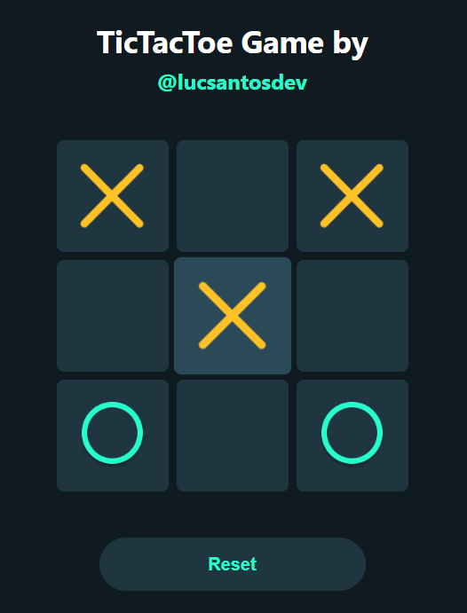

# tic-tac-toe-game
> This project is a responsive TicTacToe Game developed using React.



## 🚀 Project Description  
This project is a completely functional game created by using React JS, HTML and CSS. The game can be played by 2 players and after winning it will display the winner player. This project is also responsive and it can be played in any device.
---

## ✨ Functionalities  
- **Interactive Game:** the game responds to user participation. 
- **Winner Claim:** the winner is displayed on the screen.
- **Authenticated Access:** play as many times as you want.
- **Responsive Design:** for access on different devices.  

---

## 🛠️ Technologies Used  
| Technology        | Description         |  
|--------------------|---------------------|  
| React JS          | User Interface     |  
| HTML/CSS         | Styling and Responsiveness       |  

---

## 📦 Installation  
1. Clone the repository:  
   ```bash
   git clone https://github.com/lucsantosdev/tic-tac-toe-game.git
2. Navigate to the project directory:  
   ```bash
   cd tic-tac-toe-game
3. Run the project:  
   ```bash
   npm start
4. Open http://localhost:3000 to view it in your browser

---

## 📝 License
This project is licensed under the MIT License. See the LICENSE file for details.

---

## 💬 Connect with Me
Follow my journey and other projects on:
- **Email:** [lucsantosdev@gmail.com](mailto:lucsantosdev@gmail.com)
- **LinkedIn:** [lucsantosdev](https://www.linkedin.com/in/lucsantosdev)
- **GitHub:** [lucsantosdev](https://github.com/lucsantosdev)

---

🧠 Je 9:23-24